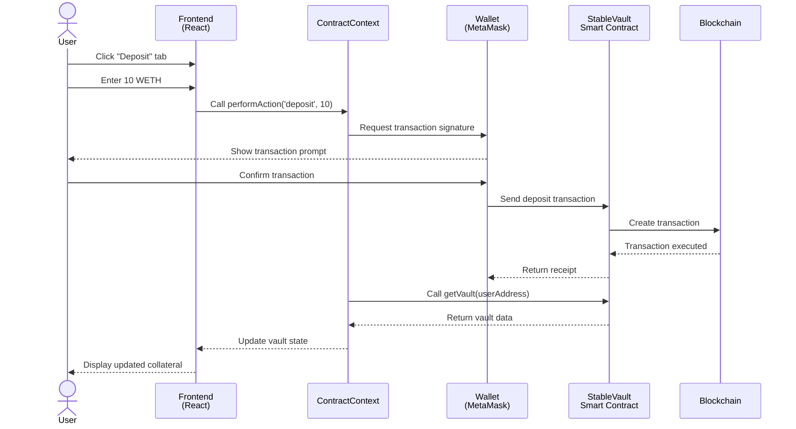
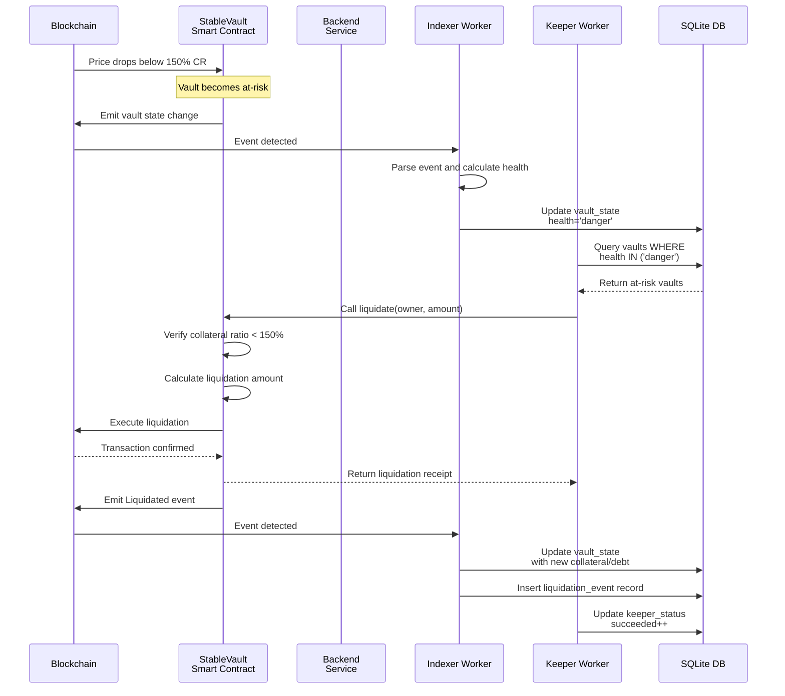
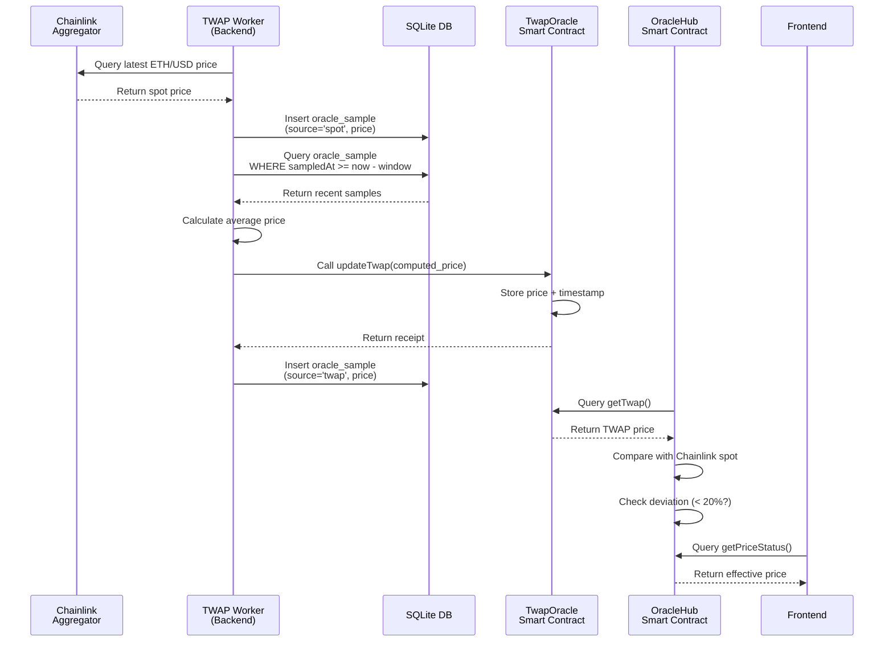
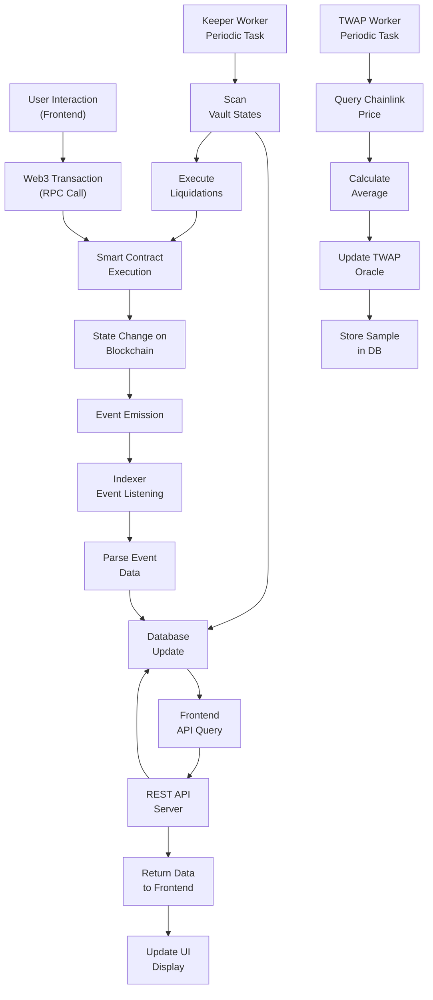
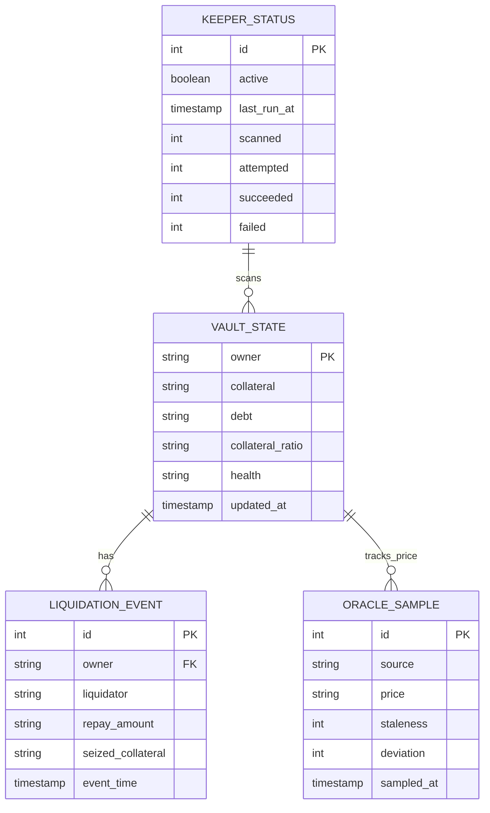

# Architecture Documentation: System Design and Component Interaction

## System Overview

StableVault is a three-tier distributed system consisting of smart contracts on Sepolia blockchain, a Node.js backend service, and a React frontend application. The system enables users to deposit collateral, mint stablecoins, manage positions, and handles automated liquidations through keeper bots.

## System Architecture Diagram

```mermaid
graph TB
    subgraph Frontend["Frontend Layer (React + Vite)"]
        Header["Header Component"]
        Dashboard["Dashboard Component"]
        ActionPanel["ActionPanel Component"]
        ContractContext["ContractContext<br/>(State Management)"]
    end

    subgraph Backend["Backend Layer (Node + Express)"]
        Server["REST API Server"]
        Indexer["Indexer Worker"]
        Keeper["Keeper Worker"]
        TwapWorker["TWAP Worker"]
        Database["SQLite Database"]
    end

    subgraph Contracts["Smart Contracts (Solidity)"]
        StableVault["StableVault.sol"]
        STBToken["STBToken.sol"]
        OracleHub["OracleHub.sol"]
        TwapOracle["TwapOracle.sol"]
    end

    Frontend -->|REST API| Backend
    Backend -->|Web3 RPC| Contracts
    Contracts -->|Events| Indexer
    Indexer -->|Update State| Database
    Server -->|Query Data| Database
    ContractContext -->|Read Contract State| StableVault
    ContractContext -->|Read Oracle| OracleHub
    Keeper -->|Call liquidate()| StableVault
    TwapWorker -->|Call updateTwap()| TwapOracle

    Frontend -->|Display| Header
    Frontend -->|Display| Dashboard
    Frontend -->|User Interaction| ActionPanel
    Dashboard -->|Read Data| ContractContext
    ActionPanel -->|Update Data| ContractContext
    ContractContext -->|Fetch Metrics| Server
```

## Component Details

### Frontend Layer

The frontend is built with React and Vite, providing a user interface for interacting with the protocol. The Header component handles wallet connection using Wagmi, which integrates with MetaMask and other Web3 wallets. The Dashboard displays real-time information about the user's vault including collateral amount, debt, and collateral ratio. The ActionPanel provides input forms for deposit, mint, repay, and withdraw operations. The ContractContext uses React Context to manage global state and handle all smart contract interactions through ethers.js or viem.

### Backend Layer

The backend is a Node.js service using Express that manages four main workers and a REST API server.

The REST API Server exposes endpoints at /health, /v1/protocol/metrics, /v1/oracle/status, /v1/vaults/:owner, /v1/vaults?health=danger, /v1/liquidations, and /v1/keeper/status. These endpoints allow the frontend and external systems to query vault states, oracle prices, protocol metrics, and liquidation history.

The Indexer Worker listens to blockchain events including Deposited, Withdrawn, Minted, Repaid, and Liquidated events. It extracts vault owner information from these events and updates the vault_state table in the database. It also maintains a history of liquidation events in the liquidation_event table.

The Keeper Worker periodically scans the vault_state table for vaults with health status of "danger" or "warning". For each at-risk vault, it attempts to execute a liquidate() transaction on the StableVault contract. It implements retry logic with exponential backoff to handle transaction failures. The status of keeper operations is tracked in the keeper_status table.

The TWAP Worker runs at regular intervals to calculate time-weighted average prices. It samples the current Chainlink ETH/USD price, stores it in the oracle_sample table, and calculates the average of recent samples within the configured time window. It then calls updateTwap() on the TwapOracle contract to update the on-chain TWAP price.

The SQLite Database stores all state using Prisma ORM. It includes tables for vault_state, liquidation_event, oracle_sample, and keeper_status.

### Smart Contracts Layer

StableVault.sol is the core contract managing vault creation, deposits, minting, repayment, and liquidation. It stores vault information in a mapping from owner address to Vault struct. It maintains protocol parameters like minimum collateral ratio (150%), stability fee (4% annually), and liquidation bonus (8%). It calls OracleHub to verify prices before executing risky operations.

STBToken.sol is an ERC20 token representing the stablecoin. Only StableVault can mint and burn tokens. Users can transfer and approve STB for spending.

OracleHub.sol verifies prices using both Chainlink aggregators and the TWAP oracle. It implements a circuit breaker that disables risky operations when prices deviate by more than 20% between spot and TWAP prices. It returns the effective price for liquidation calculations.

TwapOracle.sol stores the most recent TWAP price updated by the backend TWAP Worker. It maintains the timestamp of the last update to detect stale prices.

## Component Interaction Flows

### User Deposit Flow



### Keeper Liquidation Flow



### TWAP Price Update Flow



### Frontend State Sync Flow

```mermaid
graph LR
    A["User Action<br/>(Deposit/Mint/etc)"] -->|performAction| B["ContractContext"]
    B -->|Call Smart Contract| C["StableVault"]
    C -->|Execute Transaction| D["Blockchain"]
    D -->|Emit Event| E["Event Stream"]
    E -->|Listened by| F["Indexer Worker"]
    F -->|Parse & Update| G["SQLite Database"]
    
    H["Timer/Manual Refresh"] -->|refresh| B
    B -->|Call getVault| C
    C -->|Return State| B
    B -->|setData| I["React State"]
    I -->|Re-render| J["UI Components"]
    
    K["API Poll"] -->|GET /v1/protocol/metrics| L["REST Server"]
    L -->|Query DB| G
    G -->|Return Data| L
    L -->|Return JSON| K
    K -->|Update| I
```



## Data Flow Diagram



## Database Schema Relationships



## Component Interaction Matrix

The ContractContext interacts with StableVault for reading vault state, collateral ratio, and ownership. It also reads from OracleHub for price information. The Indexer Worker listens to events from StableVault and writes updates to the database. The Keeper Worker reads vault states from the database and calls StableVault liquidate() function. The TWAP Worker reads Chainlink prices and writes to TwapOracle, then stores samples in the database. The REST Server reads all data from the database to serve API requests.

## Synchronization Mechanisms

State synchronization between frontend and backend happens through the REST API. The frontend polls specific endpoints or reacts to user actions by refreshing via ContractContext. The database acts as the single source of truth for historical data and current vault states.

Smart contract state is verified by the frontend reading directly from blockchain via RPC calls. This provides immediate confirmation of transactions. The backend eventually indexes these changes through event listening and updates the database.

The TWAP Worker and Keeper Worker run on scheduled intervals to perform their duties. Keeper attempts to liquidate at-risk vaults every few seconds, while TWAP updates occur at configurable intervals like every minute.

## Error Handling and Recovery

If a keeper liquidation transaction fails, it retries with exponential backoff up to the configured maximum attempts. Failed liquidations are logged in the keeper_status table for debugging.

If an oracle price deviates too much from TWAP, the circuit breaker prevents risky operations. The system automatically resumes when prices normalize.

If the backend becomes unavailable, users cannot see real-time data but can still interact with smart contracts directly using tools like etherscan.

If a transaction fails on-chain, the frontend catches the error and displays it to the user. The backend does not record failed transactions in the database.

## Scalability Considerations

The current architecture stores all vault states in a single SQLite database. For production deployment, this could be upgraded to PostgreSQL with read replicas.

The keeper worker scans all at-risk vaults sequentially. For high volume, this could be parallelized across multiple keeper instances with a distributed lock to prevent duplicate liquidations.

The TWAP worker calculates averages over a time window stored in the database. For more sophisticated price aggregation, additional oracle sources could be integrated.

The REST API endpoints are stateless and can be replicated across multiple backend instances behind a load balancer.

## Security Considerations

All user operations require wallet signatures, which are verified by smart contracts. The backend does not hold private keys and cannot execute transactions without user approval.

The keeper operates with a specific KEEPER_ADDRESS that is authorized in the smart contract. This prevents unauthorized liquidations.

The oracle circuit breaker prevents operation during price anomalies that could indicate manipulation.

Smart contract state is immutable on the blockchain and cannot be forged by the backend or frontend.
