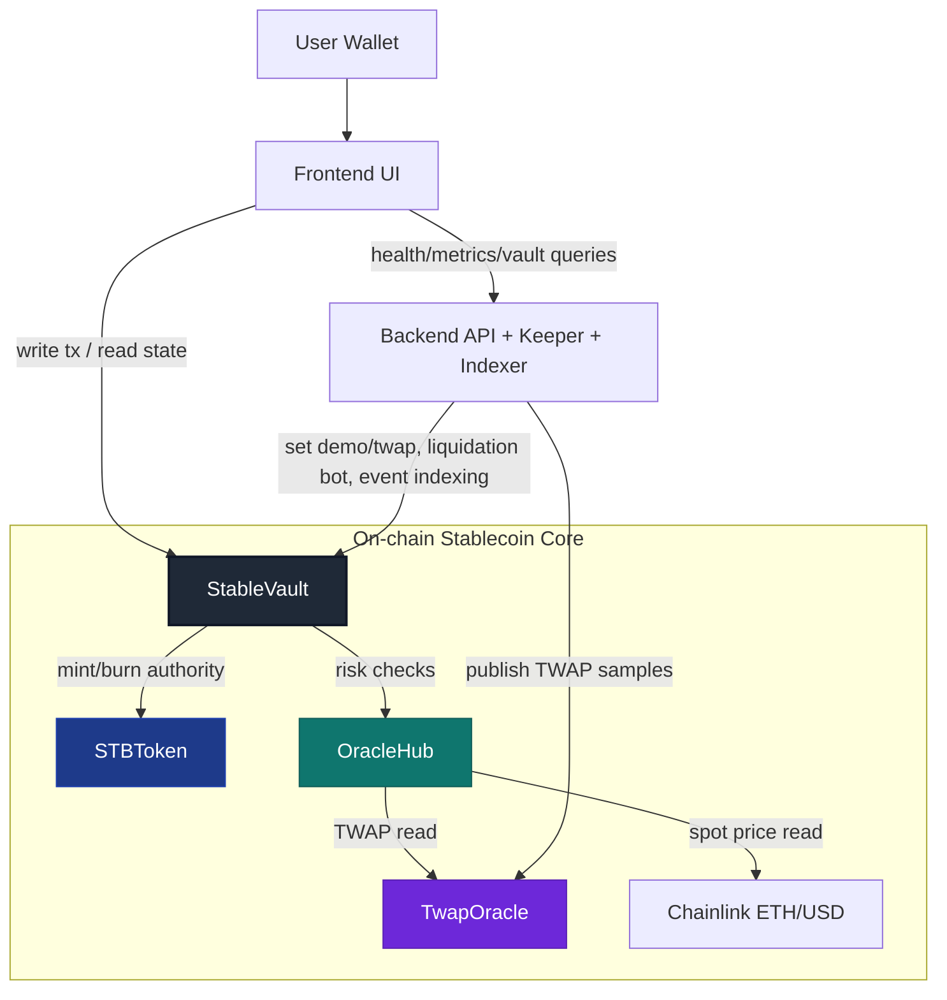

# StableVault Architecture (Stablecoin-Centric)

## 1. Design Focus
The architecture is centered on the on-chain stablecoin system:
- `StableVault` is the core risk engine.
- `STBToken` is the mint/burn asset.
- `OracleHub` + `TwapOracle` provide price validity and breaker control.

Frontend and backend are supporting layers, not the trust core.

## 2. Mermaid Architecture Diagram

## 3. Contract Responsibilities

### StableVault (Core)
- Maintains vault state: collateral, debt principal, accrued fee.
- Handles user actions: `deposit`, `withdraw`, `mint`, `repay`.
- Executes `liquidate` for unhealthy vaults.
- Tracks protocol reserve and `systemBadDebt`.
- Enforces controls: pause, keeper permissions, risk parameters.

### STBToken
- ERC20-compatible stablecoin.
- Only `StableVault` can `mint` and `burn`.
- Standard transfer/approve/allowance for user and keeper flows.

### OracleHub
- Combines spot + TWAP into validated risk price.
- Breaker triggers on stale/deviated oracle data.
- Supports owner-controlled demo mode for deterministic testing.

### TwapOracle
- Stores latest published TWAP price and timestamp.
- Accepts updates only from owner/authorized publisher.

## 4. Key Design Decisions and Trade-offs
- **Single core vault contract**:
  - simpler integration and audit path
  - trade-off: large core contract surface
- **Oracle breaker before risky actions**:
  - protects against bad pricing during mint/withdraw/liquidate windows
  - trade-off: temporary user operation blocking during anomalies
- **Keeper-based liquidation**:
  - automates unhealthy vault cleanup
  - trade-off: backend operator availability matters for automation quality
- **Demo mode in OracleHub**:
  - enables reliable demo/testing of liquidation and bad debt scenarios
  - trade-off: strictly admin-controlled to avoid production misuse

